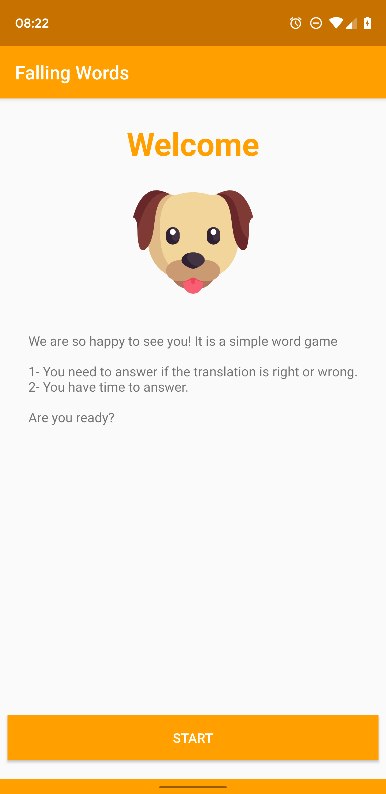
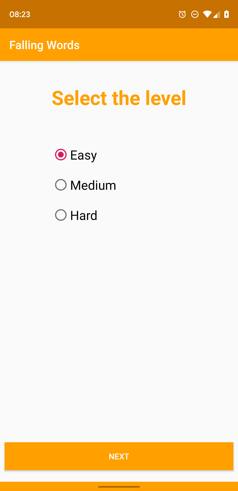
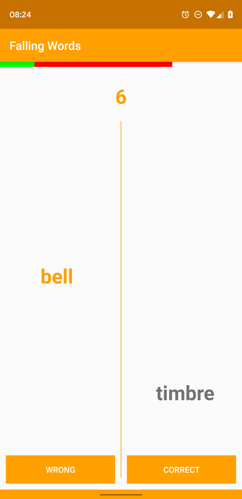
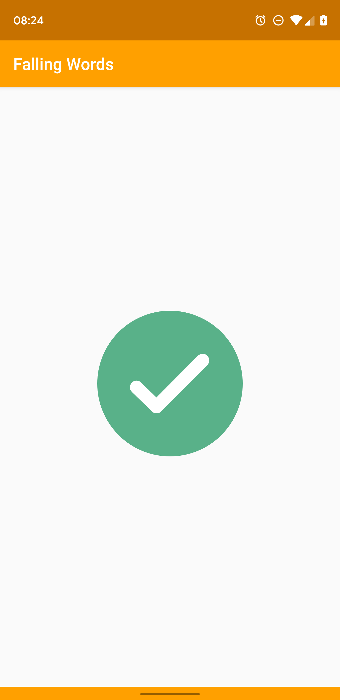
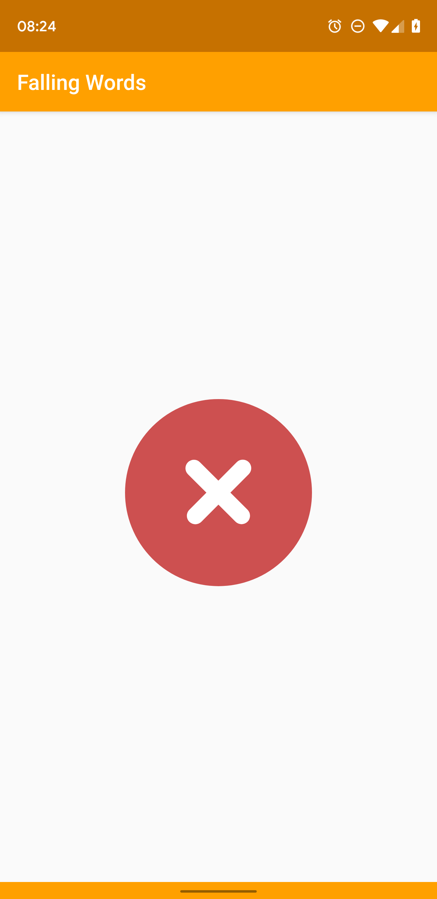
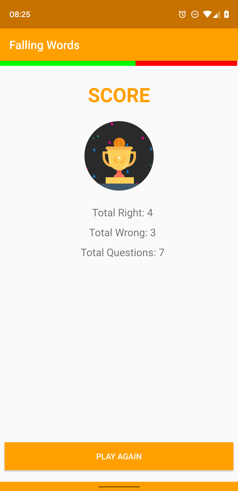

# FALLING WORDS

> An Android simple game written in Kotlin

## Overview

Small language game, the player will see a word in language „one“ on the screen. While this word is displayed, a word in language „two“ will fall down on the screen. The player will have to choose if the falling word is the correct translation or a wrong translation.

This project is 100% written in Kotlin.

## Architecture

MVI - User interaction with the UI is processed by business logic which brings change in the state. This new state is rendered on view and this newly updated view is shown to the user. This leads to a Unidirectional and Circular Data Flow.

## ScreenShots

## Knowledge Stack

This project leverages on

- 100% powered by AndroidX 
- RxJava2 for end-to-end reactive programming
- Dagger2 for Dependency Injection
- Lottie Animation
- Arch Lifecycle
- Junit
- MockitoKotlin
- Assertj

